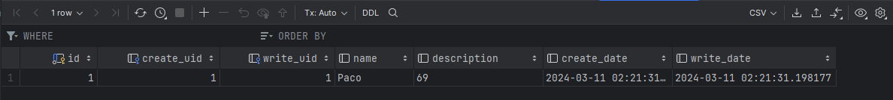

# ModuloOdoo

## Que es OpenAcademy?
Open Academy es un módulo de Odoo que nos permite gestionar cursos, sesiones, asistentes, etc, este es utilizado en direntes empresas para gestionar diferentes cursos y sesiones.


## Docker compose:

### Odoo:


### Postgres:


En el apartado de postrges tenemos que tener cuidado con los puertos que utilizamos ya que si tenemos otro servicio que este utilizando el puerto 5432 no podremos utilizarlo.

### Para ejecutar el docker-compose.yml utilizamos el siguiente comando:


```bash
docker-compose up -d
```
## Funcionamiento de la base de datos desde nuestro IDE:

Para comprobar que la base de datos esta en correcto funcionamiento podemos desde nuestro IDE en mi caso Pycharm comprobar que la base de datos esta en funcionamiento:
+ Lo primero que tendremos que hacer es entrar en nuestra pestaña de bases de datos de nuestro IDE y crear una base de datos en Postgresql.


+ Una vez creada la base de datos nos aparecera una nueva pestaña emergente en la cual tendremos que rellenar diferentes campos como pueden ser el Usuario, la contraseña, el host, el puerto... en esta ventana una vez introduciomos todos los campos necesarios podemos hacer una comporbacion de la conexion para comprobar que todo esta en correcto funcionamiento.


+ Una vez creada la base de datos y comprobado que esta en correcto funcionamiento aparecera en la pestaña de bases de datos de nuestro IDE.


## Comprobacion de que odoo esta en correcto funcionamiento:
Para comprobar que odoo esta en correcto funcionamiento tendremos que introducir en la url de nuestro navegador <localhost:8069> y nos aparecera la ventana de inicio de sesion de odoo.


### Comprobacion de que la nueva base de datos creada con odoo esta en funcionamiento:
Para comprobar que la base de datos esta en correcto funcionamiento debemos entrar denuevo en la pestaña de bases de datos y devemos refrescar, una vez refrescamos nos daremos cuenta de que a la derecha de la base de datos hay una nueva etiqueta de 1 of 2 lo cual nos indica que la base de datos fue creada con exito y esta en correcto funcionamiento.


### Instalar Modulo OpenAcademy

Para instalar el modulo de OpenAcademy en Odoo tendremos que seguir los siguientes pasos:
+ Lo primero que tendremos que hacer es crear un nuevo directorio dentro de nuestro proyecto el cual se llame `extra-addons`.
+ Una vez creado el directorio debemos vincular el docker-compose con el volumen `extra-addons:/mnt/extra-addons` para que odoo pueda leer el modulo.

+ Una vez tenemos estos pasos completados debemos utilizar una serie de comandos para poder instalar el modulo en odoo:
```bash
docker exec -u root -it nombre_contenedor_odoo-web-1 /bin/bash
```
+ Una vez dentro del contenedor de odoo debemos entrar en la carpeta de addons con el siguiente comando:
```bash
cd /mnt/extra-addons
```
+ En el siguiente paso crearemos un modulo utilizando el siguiente comando:
```bash
odoo scaffold openacademy
```
+ En el momento que creemos el modulo utilizando el comando aneterior utilizaremos el siguiente comando para cambiar los permisos de la carpeta del modulo:
```bash
chown -R 777 openacademy
```
+ Una vez cambiados los permidos de la carpeta utilizaremos el comando `exit` para salir del contenedor de odoo y lo reiniciaremos con el comando:
```bash
docker restart moduloodoo-web-1 
```
+ Cuando acabemos de utilizar todos los comandos la estructura de nuestro proyecto deberia quedar de la siguiente manera:


## Configuracion del modulo OpenAcademy
Una vez creamos el modulo de openacademy nos dirigiremos a la carpeta models y debemos modificar el archivo `models.py` dentro del archivo debemos modificar la clase TestModel


## Creacion de la vista
En este paso debemos situarnos en la carpeta de views y debemos modificar el archivo `viws.xml`. Una vez dentro del archivo debemos descomentar y modificar algunas lineas del siguiente codigo:

En esta parte del codigo debemos modificar el apartado `<field name="model">` por el nombre de la tabla que hemos creado, en mi caso `test_model`


En estaparte del codigo debemos modificar el apartado `<field name"res_model">` por el nombre de nuestra tabla, en mi caso `test_model`


En esta parte del codigo no es necesario modificar nada simplemente debemos descomentar esta parte del codigo.


## Cambio de acceso a la vista
Para poder ver nuestra vista es necesario cambiar el acceso a la vista, para ello debemos dirigirnos a la carpeta de security y modificar el archivo `ir.model.access.csv` en este archivo debemos modificar la segunda linea de codigo por la siguiente:
```
access_openacademy_openacademy,openacademy.openacademy,model_test_model,base.group_user,1,1,1,1
```
Por ultimo debemos ir al archivo `__manifest__.py` y descomentar la siguiente linea de codigo:
```
'security/ir.model.access.csv',
```
Despues de realizar todos estos pasos debemos reiniciar el contenedor de odoo con el siguiente comando:
```
docker compose restart
```
Una vez reiniciado el contenedor de odoo debemos ir a la url de nuestro navegador <localhost:8069> y nos aparecera la ventana de inicio de sesion de odoo, una vez dentro de la ventana de inicio de sesion debemos ir a la pestaña de aplicaciones y buscar el modulo de openacademy, una vez encontrado el modulo debemos instalarlo y una vez instalado nos aparecera en la pestaña de aplicaciones el modulo de openacademy.


A contunacion iremos a la base de datos y seleccionaremos el apartado `public > tables` en este apartado podremos encontrar la tabla `test_model`.


Para introducir datos a nuestra tabla para ello crearemos una carpeta llamada `data` y dentro de esta un archivo `datos.xml` y escribirremos el siguiente codigo para que encaje con nuestro `models.py`

```
 <odoo>
    <data>
        <record model="test_model" id="openacademy.nombres">
            <field name="name">Paco</field>
            <field name="description">69</field>
        </record>
    </data>
</odoo>
```

Una vez tenemos el archivo `dato.xml` lo añadimos a nuestro `__manifest__.py` dentro de la seccion de `data` poniendo el nombre de nuestro nuevo archivo.

```   
'data': [
        'security/ir.model.access.csv',
        'views/views.xml',
        'data/data.xml',
        'views/templates.xml',
    ],
```

Tras estos pasos reiniciaremos el contenedor y refrfescaremos la base de datos para aplicar los cambios hechos. Ahora ya podremos ver nuestra tabla con los datos introducidos anteriormente.



Otra forma de introducir datos en nuestra tabla es mediante la interfaz de odoo para ello debemos darle al boton de `nuevo` e introducir los datod manualmente.


